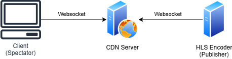

# HLS Websocket CDN

This project is a simple CDN (Content delivery network) to deliver HLS (HTTP Live Streaming) video streams using websocket connections, with the purpose of reducing the delay as much as possible and keeping the system scalable.

The project incudes the following components:

 - [Server](./server/) - The main backend component of the CDN, implemented in the [Go](https://go.dev/) programming language.
 - [Javascript client](./client-js/) - A JavasScript client for browsers to be able to receive the streams.

## Design

The CDN is composed by servers. Servers allow both pushing and pulling HLS streams via websocket.

If you have a single server, the architecture is the simplest: The server will relay the HLS fragments from the publisher to the spectators.

The most frequent case is having multiple servers. In this case, a publish registry database ([Redis](https://redis.io) or equivalent) is required for the servers to share information about what server is the one where a stream is being published.

When receiving a pull request, the server will try to find the stream from 3 different sources, in this order:

 - First, if publishing is enabled for the server, it will try finding the stream internally. It it finds it, it will relay the fragments without connecting to any other servers.
 - Second, if enabled, it will ask the Redis database to figure out what server is the one being used to publish the stream. If found, the server will connect to the publishing server and relay the fragments received from it.
 - Third, if enabled, it will connect to another server and relay the fragments from it.

The 3 methods can be individually enabled or disabled. This allows you to customize your CDN architecture.

Example: You can separate the servers used to publish from the servers used to receive the stream using gateways for each region.

## Documentation

 - [Websocket protocol documentation](./documentation/websocket-protocol.md)
 - [Authentication mechanism documentation](./documentation/authentication.md)

## License

This project is under the [MIT License](./LICENSE).
